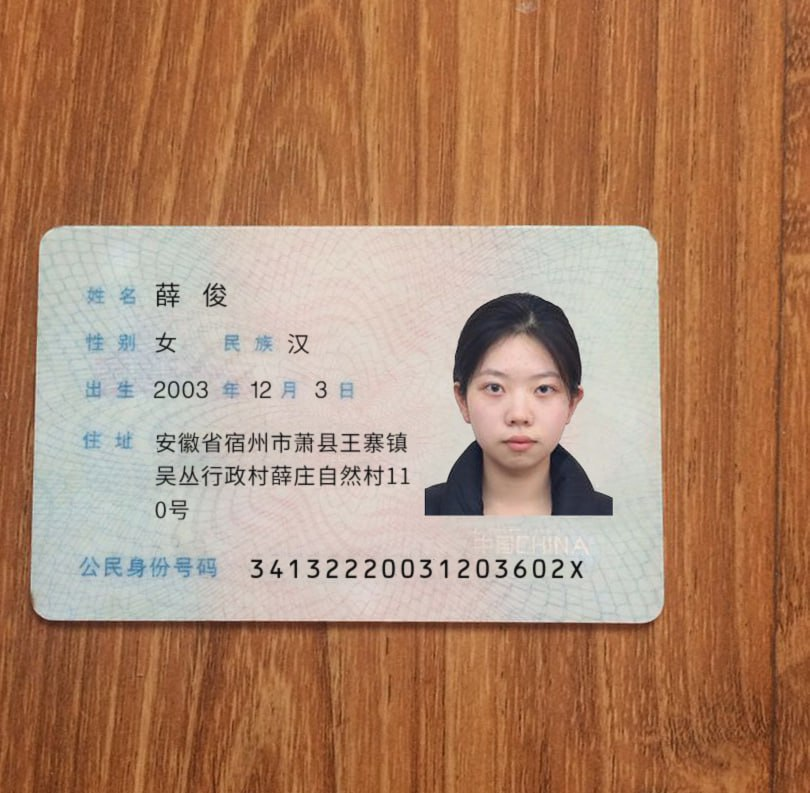
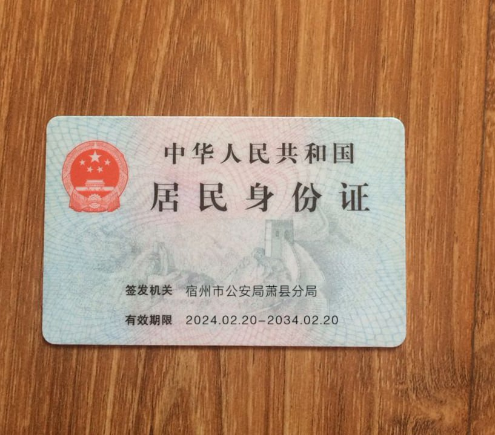
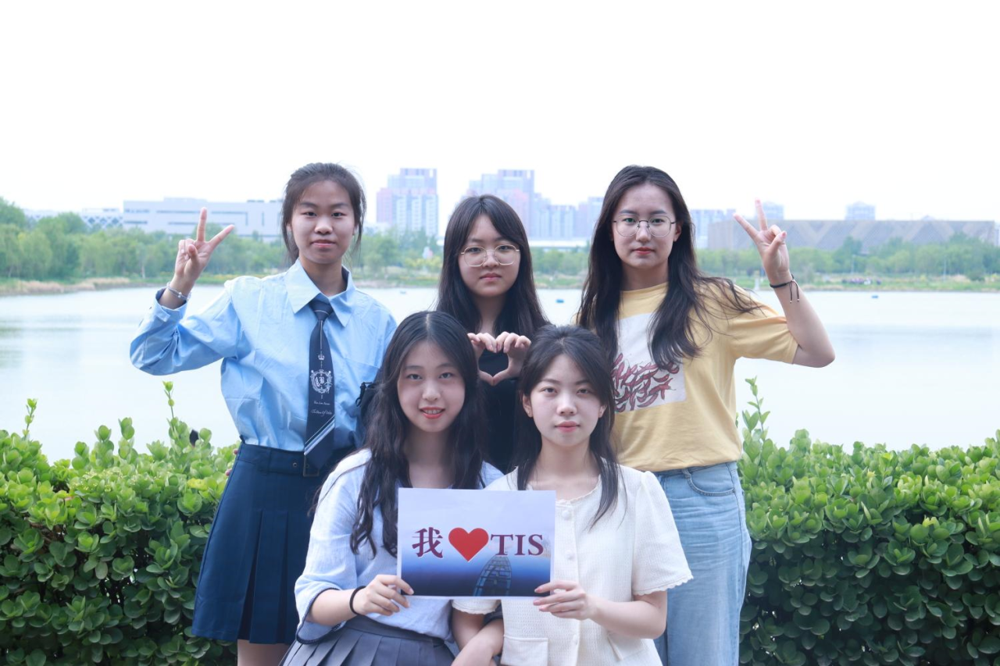

# crawlerxj
爬虫小项目——爬取薛俊同学的大学电子足迹。

| 主要爬虫脚本 | 功能描述 |
|--------------|----------|
| `login.py`   | 教务系统，可查看学籍信息、课表和成绩 |
| `web.py`、`pay.py` | 财务处，可查看银行卡资金流水 |
| `plat.py`    | 一卡通，可查看一卡通使用情况 |
| `practice.py`| 实践管理，可查看大创、竞赛报名信息 |

| 文件名            | 数据内容描述 |
|-------------------|-------------|
| `bill_info.txt`   | 银行卡资金流水信息 |
| `transactions.csv`| 在学校使用一卡通付费(包含电子账户)信息 |
| `practice_info.txt`| 实践、实训、竞赛、大创信息 |

希望以上数据对您有所帮助！

## 学生卡照片

## 身份证信息

## 生活照
### 薛俊为第一排右侧

